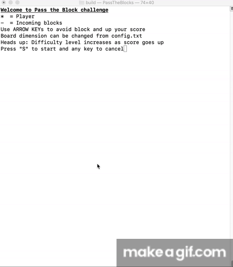
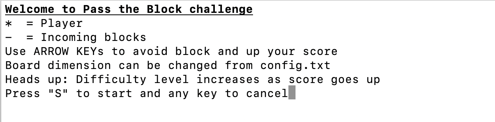
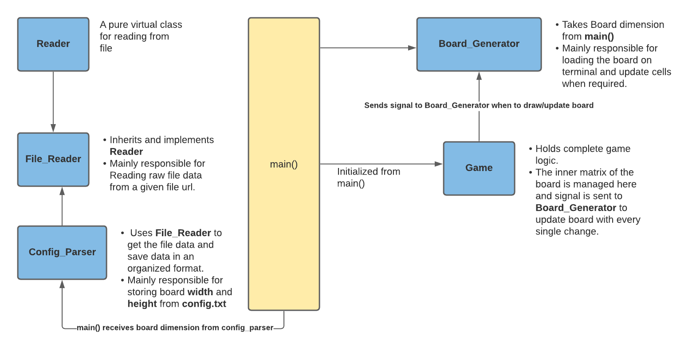

# Pass The Blocks
A fun 2D terminal game built with C++.

## Description
The game is basically all about ducking the incoming blocks or obstacles. The player (indicated by '*') is spawned at the bottom of the playground or board. Obstacles would generate on top of the board and would start to come down to hit the player. Each obstacle would have some gaps. Player would have to take advantage of the gaps by pressing the `Arrow Keys` and duck the obstacles.

Each obstacle player ducks score increases by 1. With increasing score game would grow more difficult with faster obstacle and smaller gaps. I dare anyone making a score 40. My personal best is 32! :) 

## Dependency
This project has dependency on [ncurses library](https://invisible-island.net/ncurses/announce.html) for visual representation and [cmake](https://cmake.org/download/) for compiling and running the project.

## Setting configuration
Game board or boundary is modifiable from the `config.txt` file. Below are the things to remember while updating the config file.

1. width/length ratio = 2 : 1. If width = 70, length = 35.
2. 100 &ge; width &ge; 30   

## Instructions to run
1. Navigate to project directory and run `mkdir build && cd build` on terminal.
2. Run `cmake ..`
3. Run `make`. This will generate an executable inside `build` folder named `PassTheBlocks`
4. Run `./PassTheBlocks`
5. A display will appear as below
    
6. Press 'S' (not case-sensitive) to get in action or any key to terminate the program.    

## Note
Once there's a collision everything halts. Please press any of the `Arrow Keys` to get to the next screen.

## Deep dive

- ### Top level investigation
    Below is the upper level breakdown of classes.
    
- ### Class & Method level investigation
    - `class Reader`
        - `parse_file()`
            - A virtual method for file reading
    - `class File_Reader`
        - `parse_file()`
            - Implementation of the virtual method. Reads a file at a given url and stores the dimensions in a `std::vector`
        - `get_file_data()`
            - Returns the `std::vector` holding the dimension
    - `class Config_Parser`
        - `parse_and_store_data()`
            - Uses `File_Reader` to provide file url and get the dimensions and save them in a public `unordered map`
    - `class Board_Generator`
        - `draw_board()`
            - Draws the board initially in terminal
        - `update_cell(int, int, int, int, int)`
            - Updates an individual cell in the terminal, specially changes player position
        - `update_cell(int, vector<int>&, int)`
            - Updates range of cells in the terminal, specially changes obstacle position       
    - `class Game`
        - `load_game()`: Initializes inner matrix of the board without placing player or obstacle
        - `launch_game()`: 
            - Draws the board in the terminal initially.
            - Initiates a thread for obstacle generation and moving them
            - Initiates a player/vehicle thread for user interaction
            - This is the main cockpit for the overall game
        - `move_my_vehicle()`
            - Responsible for launching a player thread
            - Spawns the player and updates board
            - Detects user key press and take action accordingly
            - Takes a `std::unique_lock` and provides obstacle thread a go-ahead by notifying
        - `generate_obstacle()`
            - Responsible for launching an obstacle thread 
            - Once player/vehicle is created this thread starts its job
            - Randomly generates gap start index and modify matrix and board in terminal
            - Moves the obstacle downward and checks for collision
            - Keeps track of player score
        - `check_collision_from_obstacle()`
            - Checks if collision occured once an obstacle has moved
        - `check_collision_from_vehicle()`
            -  Checks if collision occured once player has moved    
        - `get_obstacle_delay()`
            - Sets obstacle moving delay based on user score. The less the delay, game gets more difficult
        - `get_obstacle_gap()`
            - Sets obstacle gap based on user score. The less the gap, game gets more difficult
        - `stop_game()`
            - Uses a locking mechanism as either player or obstacle thread might want to reach it. Whoever reaches first stops the game.
        - `change_inner_board_value()`
            - Both the player and obstacle thread use this method to modify inner matrix data. So it was made thread-safe by locking.
        - `get_inner_board_cell()`
            - For reading inner matrix data 
        - `post_game_over()`
            - Display screen after game is over

<!-- ## Rubrics Addressed
1. `The submission must compile and run`: checked
2. `The project demonstrates an understanding of C++ functions and control structures.`: checked
3. `The project reads data from a file and process the data, or the program writes data to a file.`: Board dimension is read in `class File_Reader` from `config.txt` in root directory
4. `The project accepts user input and processes the input.`: User interaction takes place in `class Game`'s `move_my_vehicle()` method under the `switch`.
5. `The project uses Object Oriented Programming techniques.` - checked
6. `Classes use appropriate access specifiers for class members.` - checked
7. `Class constructors utilize member initialization lists.` - `Board_Generator`, `Game` both of them use initialization list
8. `Classes abstract implementation details from their interfaces.`: `Game` abstracts most of its functionality
9. `Classes encapsulate behavior.` - checked
10. `Classes follow an appropriate inheritance hierarchy.` - Although most of the classes are independent from inheriting, there's an abstract class `Reader` which is inherited and implemented by `File_Reader`
11. `Overloaded functions allow the same function to operate on different parameters.`: `Board_Generator` has 2 overloaded functions called `update_cell()`
12. `Derived class functions override virtual base class functions.`: `File_Reader` overrides `Reader` method called `parse_file()`
13. `Templates generalize functions in the project.`: `File_Reader` constructor takes in a generic parameter.
14. `The project makes use of references in function declarations.`: `Board_Generator` constructor takes reference of couple parameters
15. `The project uses destructors appropriately.`: Most of the dynamic resources are RAII based, there is one pointer that roamed overall project which is the `WINDOW` object. `Board_Generator` & `Game` uses destructors to free the resource captured by that object.
16. `The project uses scope / Resource Acquisition Is Initialization (RAII) where appropriate.`: Smart pointers are used to maintain RAII standard in `main()`. I haven't built a customized class though.
17. `The project uses move semantics to move data, instead of copying it, where possible.`: In `main()`, `Board_Generator` instance is moved to `Game` instance on line 64.
18. `The project uses smart pointers instead of raw pointers.`: All pointers are smart pointers except for the `WINDOW` pointer which is a ncurses library pointer.
19. `The project uses multithreading.`: checked.
20. `A promise and future is used in the project.`: Within `launch_game()` in `Game` player or vehicle thread is launched with a promise and subsequent future.
21. `A mutex or lock is used in the project.`: Used multiple times inside `Game`
22. `A condition variable is used in the project.`: checked. Used in `game.cpp` line 53-57 and 127-131  
-->

